<div align="center">

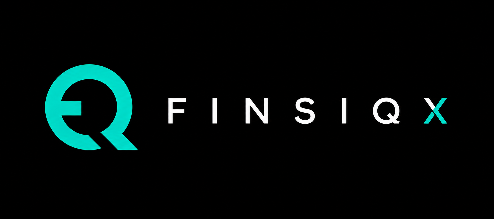

# FINSIQX

**Consumer Financial Intelligence Platform for the South African Market**


[Live Demo](https://finsiqx.vercel.app) | [GitHub Repository](https://github.com/darrylchikamba/finsiqx)

</div>

---

## OVERVIEW

The problem: Western fintech apps bolt on ZAR support but don't understand how South Africans actually earn, spend, save, and share money. Stokvel cycles, load shedding costs, SARS thresholds, TFSA annual limits, municipal rates, fuel price adjustments — none of this is modelled in any existing consumer finance tool.

The solution: FINSIQX is built from the SA financial reality up. The core differentiator is the SA Financial Ontology — a proprietary 3-pass classification engine with 800+ SA-specific merchant patterns, SARS threshold tracking, stokvel detection, load-shedding intelligence, and TFSA/RA annual limit monitoring.

The intelligence layer: MALI (which means "money" in several Bantu languages) is the embedded financial intelligence assistant. MALI surfaces contextual insights across every major page, answers natural language queries about spending, and adapts its voice to South African financial realities.

## SCREENSHOTS

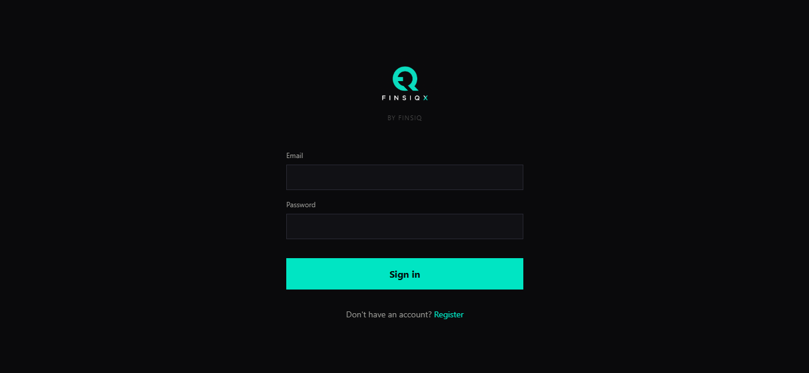
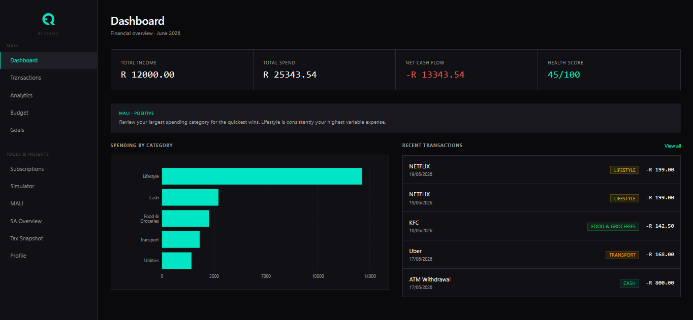
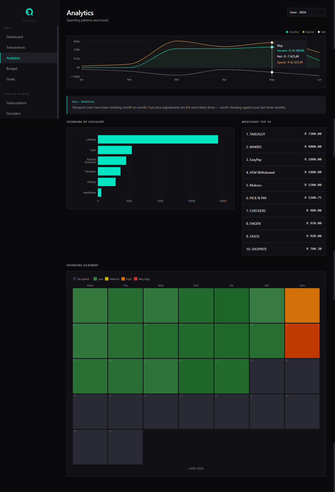
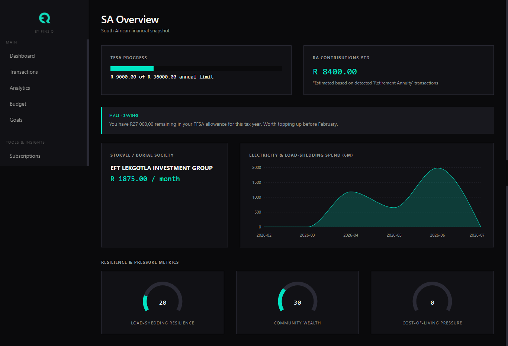
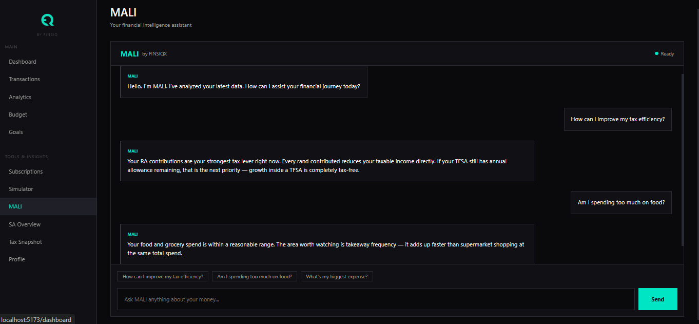
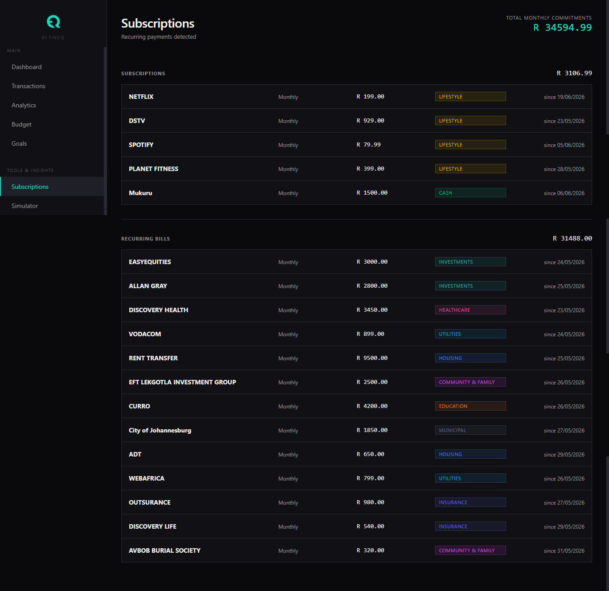
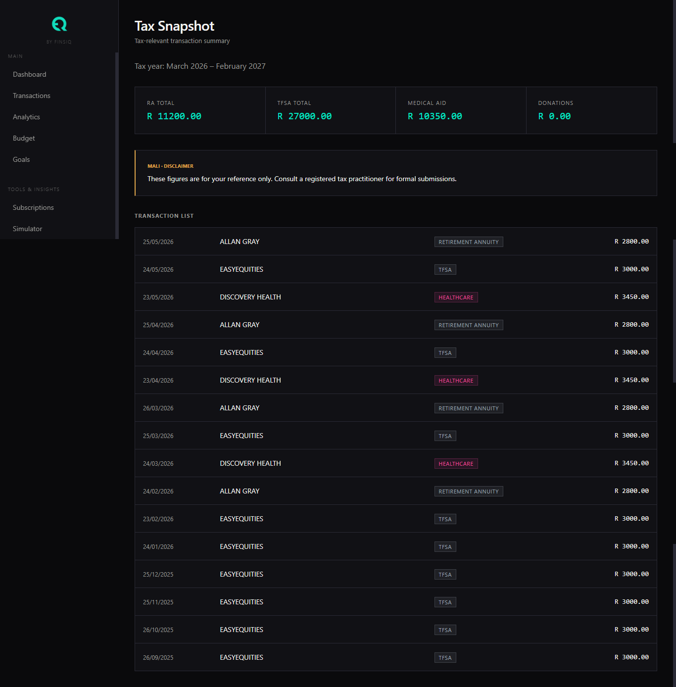

<details>
<summary>View all screens</summary>

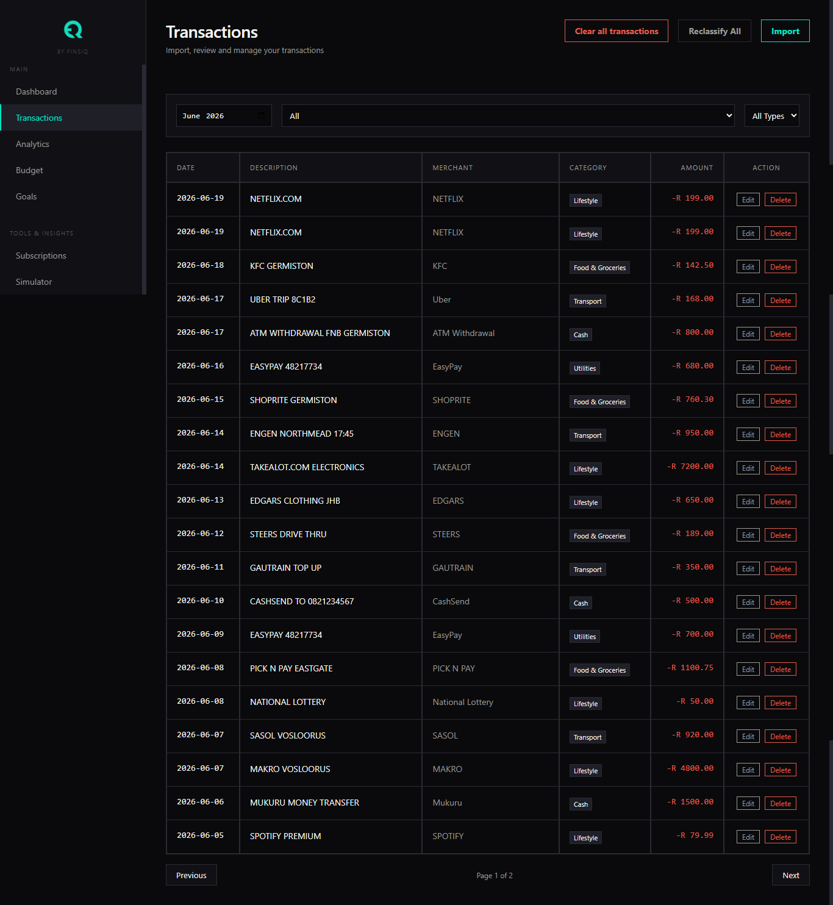
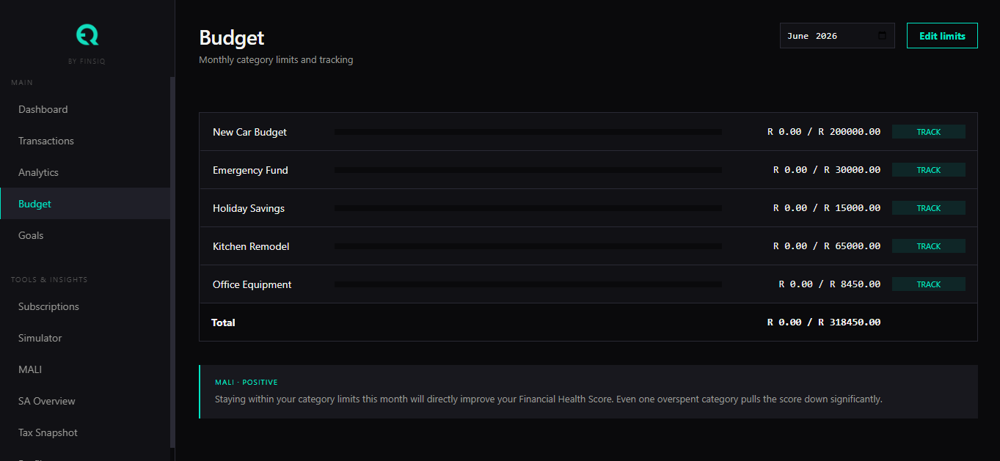
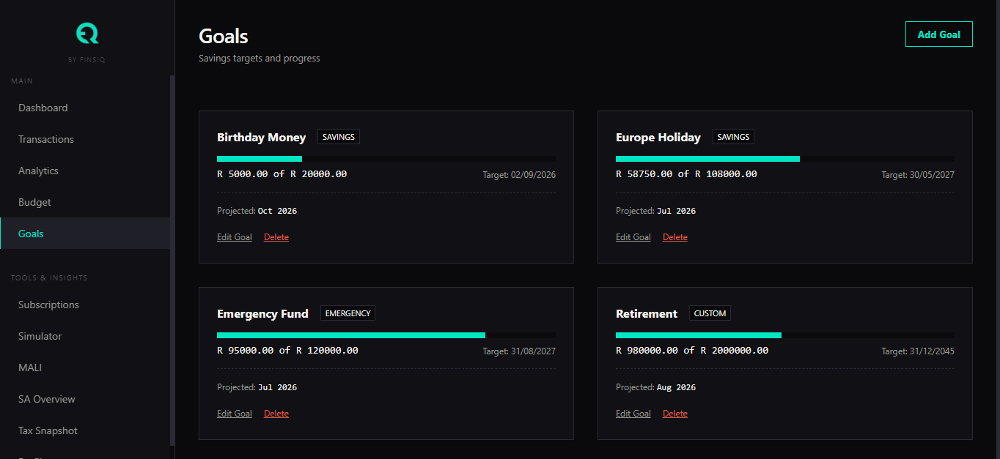
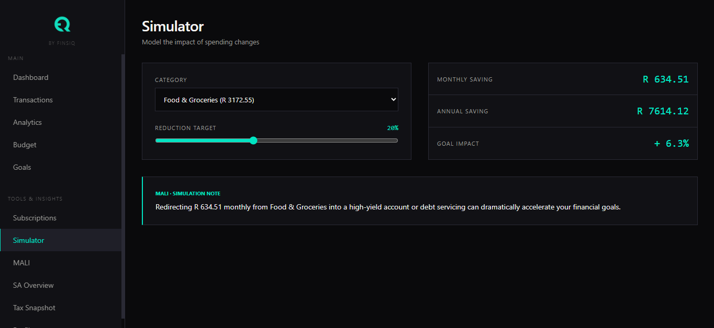
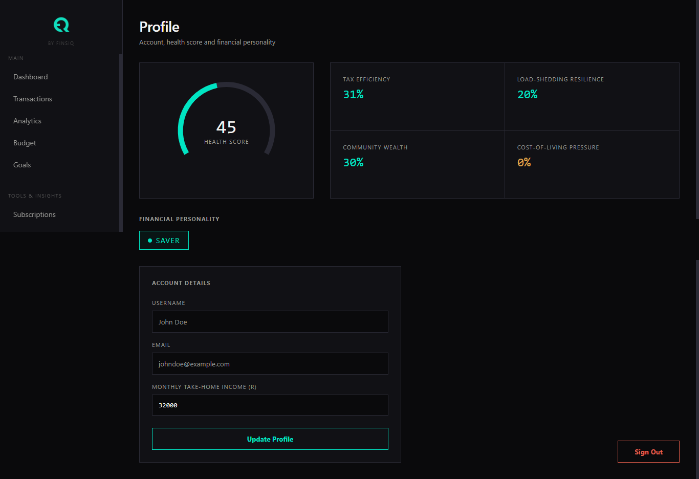

</details>

## CORE INTELLIGENCE FEATURES

### Financial Behaviour Intelligence Engine
3-pass classification pipeline. Pass 1: keyword matching against 800+ curated SA merchant patterns. Pass 2: regex matching for variable-format descriptions (EasyPay token numbers, fuel station location suffixes). Pass 3: Gemini AI batch classification for unmatched descriptions with result caching to prevent duplicate API calls.

### SA Financial Ontology
A proprietary structured knowledge base covering: fuel stations (Engen, Sasol, Shell, BP, TotalEnergies), prepaid electricity (EasyPay, Citiq, municipal), investments (EasyEquities TFSA/RA, Allan Gray, Satrix, Coronation), medical aids (Discovery Health, Bonitas, Momentum), municipalities (CoJ, Tshwane, Ekurhuleni, eThekwini, Cape Town), stokvels and burial societies, load shedding hardware retailers, public transport (Gautrain, MyCiTi, Rea Vaya), schools (Curro, AdvTech), security companies (ADT, Fidelity), and SA-specific lifestyle categories. Updated annually for SARS threshold changes.

### Personalised Financial Risk Score
A weighted composite score (0-100) from six SA-specific components: Savings Rate (25%), Budget Adherence (20%), Tax Efficiency (20%), Cost-of-Living Pressure (20%), Load-Shedding Resilience (8%), Community Wealth (7%). Each sub-score surfaces independently on the Profile page.

### Regulatory Compliance Intelligence
Real-time tracking of SARS-defined limits: TFSA annual (R36,000) and lifetime (R500,000) contribution limits, RA deduction limits (27.5% of income, max R350,000/year), tax year boundary detection (March-February). Tax-relevant transactions automatically flagged at import.

### Spending Anomaly and Fraud Awareness Layer
Statistical anomaly detection flags transactions exceeding 3x the user's category average. Duplicate charge detection identifies same-merchant same-amount transactions within 3 days. Flags persist to the database and surface in the transaction list.

### Stokvel and Community Savings Intelligence
Automatic detection of recurring fixed-amount EFTs matching stokvel contribution patterns. Distinguishes contributions (regular debits) from payout events (lump-sum credits). Tracks burial society payments separately. Unique to FINSIQX — not modelled in any Western personal finance platform.

### MALI — Embedded Financial Intelligence Assistant
Contextual AI insights surface on Dashboard, Analytics, Budget, and SA Overview pages without user prompting. Natural language query interface on the dedicated MALI page. MALI's voice is calibrated for SA financial realities: references fuel price adjustments, stokvel cycles, 13th cheque season, load shedding cost impacts. Powered by Gemini 1.5 Flash with mock fallback for cost-stable portfolio deployment.

## ARCHITECTURE

FINSIQX is built on a modern MERN stack architecture with a proprietary financial ontology layer driving classification accuracy, supported by an embedded AI layer for qualitative insights.

```text
┌─────────────────────────────────────────────────────┐
│                   FINSIQX CLIENT                    │
│              React 18 + Vite (Vercel)               │
│   13 pages · Recharts · Inline styles · JWT auth    │
└──────────────────────┬──────────────────────────────┘
                       │ HTTPS / Axios
┌──────────────────────▼──────────────────────────────┐
│                  FINSIQX API                        │
│            Node.js + Express (Render)               │
│  Auth · Transactions · Analytics · Budgets · Goals  │
│  Rate limiting · Helmet · Manual NoSQL sanitiser    │
└──────┬───────────────┬────────────────┬─────────────┘
       │               │                │
┌──────▼──────┐ ┌──────▼──────┐ ┌──────▼──────┐
│  MongoDB    │ │ SA Financial│ │  Gemini AI  │
│   Atlas     │ │  Ontology   │ │  (MALI)     │
│  Cape Town  │ │  3-pass     │ │  mock mode  │
└─────────────┘ └─────────────┘ └─────────────┘
```

Classification Pipeline:
Description → Pass 1 (Keywords) → Pass 2 (Regex) → Pass 3 (Gemini AI) → Category + Tax Flags + Merchant

## TECH STACK TABLE

| Layer | Technology | Notes |
|-------|------------|-------|
| Backend | Node.js, Express | RESTful API architecture |
| Backend | jsonwebtoken, bcryptjs | Stateless authentication |
| Backend | multer, papaparse | CSV transaction import parsing |
| Backend | xlsx | Excel file parsing fallback |
| Backend | helmet, cors, express-rate-limit | Production security hardening |
| Frontend | React 18, Vite | Component-based UI |
| Frontend | react-router-dom | Client-side routing |
| Frontend | axios | API client with interceptors |
| Frontend | recharts | Data visualization engine |
| Database | MongoDB Atlas, Mongoose | Schema validation and NoSQL storage |
| AI | @google/genai | Gemini 1.5 Flash integration |
| DevOps | Vercel, Render | Serverless edge / containerized deployments |
| DevOps | GitHub Actions | CI/CD automated test & deploy pipeline |

## SA FINANCIAL ONTOLOGY — COVERAGE

| Category | Merchants / Patterns | SA-Specific Intelligence |
|----------|----------------------|--------------------------|
| Fuel | Engen, Sasol, Shell, BP, TotalEnergies | Accounts for monthly fuel price adjustments |
| Electricity | EasyPay, Citiq, Municipal, Prepaid | Distinct from standard utilities |
| Investments | EasyEquities TFSA/RA, Allan Gray, Satrix, Coronation | Monitors against SARS contribution limits |
| Medical Aid | Discovery Health, Bonitas, Momentum | Identifies tax-relevant healthcare expenditure |
| Municipalities | CoJ, Tshwane, Ekurhuleni, eThekwini, Cape Town | Local government rates and taxes |
| Community/Stokvel | Stokvel, Burial Society, Investment Group | Detects recurring community contributions |
| Load Shedding | Hardware retailers, Inverter, Solar, Generator | Captures hidden costs of grid instability |
| Transport | Gautrain, MyCiTi, Rea Vaya, Uber | Public and private mobility tracking |
| Education | Curro, AdvTech, University | Tracks long-term educational commitments |
| Security | ADT, Fidelity, Tracker | Identifies premium security and tracking costs |

## API REFERENCE

| Group | Method | Endpoint | Auth | Description |
|-------|--------|----------|------|-------------|
| Authentication | POST | `/api/auth/register` | No | Registers new user account |
| Authentication | POST | `/api/auth/login` | No | Authenticates and returns JWT |
| Authentication | GET | `/api/auth/me` | Yes | Retrieves current user profile |
| Transactions | POST | `/api/transactions/import` | Yes | Multipart upload to parser pipeline |
| Transactions | GET | `/api/transactions` | Yes | Paginated list with multi-filter support |
| Transactions | PUT | `/api/transactions/:id` | Yes | Updates single transaction categorization |
| Transactions | DELETE | `/api/transactions/:id` | Yes | Removes imported transaction |
| Analytics | GET | `/api/analytics/summary` | Yes | Aggregates income, spend, net cash flow |
| Analytics | GET | `/api/analytics/subscriptions` | Yes | Identifies recurring bills and services |
| Analytics | GET | `/api/analytics/health` | Yes | Computes Personalised Financial Risk Score |
| Analytics | GET | `/api/analytics/sa-overview` | Yes | Retrieves SA-specific ontology metrics |
| Budgets | GET | `/api/budgets` | Yes | Retrieves user category allocations |
| Budgets | POST | `/api/budgets` | Yes | Upserts budget limits for month |
| Goals | GET | `/api/goals` | Yes | Lists savings targets |
| Goals | POST | `/api/goals` | Yes | Creates new savings target |
| Goals | PUT | `/api/goals/:id` | Yes | Updates target progress |
| Goals | DELETE | `/api/goals/:id` | Yes | Removes savings target |
| AI (MALI) | POST | `/api/ai/query` | Yes | Natural language query processor |
| AI (MALI) | POST | `/api/ai/insights` | Yes | Generates contextual page insights |

## LOCAL SETUP

### Prerequisites
- Node.js 18+
- MongoDB Atlas account (or local MongoDB instance)

### Installation
Clone the repository to your local machine:
```bash
git clone https://github.com/darrylchikamba/finsiqx.git
cd finsiqx
```

### Server Setup
Install dependencies and configure environment variables for the backend:
```bash
cd server
npm install
```
Create a `.env` file in the `server/` directory:
```env
MONGO_URI=your_mongodb_connection_string
JWT_SECRET=your_jwt_signing_secret
FRONTEND_URL=http://localhost:5173
GEMINI_API_KEY=your_gemini_api_key
MOCK_AI=true
NODE_ENV=development
```

### Client Setup
Install dependencies and configure environment variables for the frontend:
```bash
cd ../client
npm install
```
Create a `.env` file in the `client/` directory:
```env
VITE_API_URL=http://localhost:5000/api
```

### Running the Application
Start the server from the `server/` directory:
```bash
npm run dev
```
Start the client from the `client/` directory in a new terminal:
```bash
npm run dev
```
*Note: A synthetic test data file matching SA bank export formats is recommended for testing import capabilities.*

## DEPLOYMENT

FINSIQX is deployed across a robust edge and cloud architecture:
- **Frontend**: Hosted on Vercel for fast, global edge delivery.
- **Backend**: Hosted on Render, providing stable Node.js containerization.
- **Database**: MongoDB Atlas cluster located in the Cape Town region (af-south-1).

*Note: The Render backend operates on a free tier which spins down after periods of inactivity. Initial requests may experience a 30-60 second cold start delay.*

### Continuous Integration & Deployment (CI/CD)
The project utilizes GitHub Actions for its CI/CD pipeline featuring three distinct jobs:
1. `test`: Executes tests and builds the frontend compilation strictly validating stability.
2. `deploy-backend`: Triggers Render redeployment automatically once testing clears.
3. `deploy-frontend`: Runs in parallel. Note that Vercel auto-deploys seamlessly on every push to the `main` branch.

## CHALLENGES AND SOLUTIONS

### Silent CSV Type Field Bug
**Problem**: All imported transactions stored as "credit" regardless of actual type, causing Total Spend to show R0.00 across the entire analytics engine. Root cause: the import parser anchored amount detection to a single column, silently dropping all debit rows from SA banks that use separate Debit/Credit columns. 
**Resolution**: Complete import parser rewrite with multi-column detection, type normalisation, and debug logging for the first 3 parsed rows on every import.

### isRA Substring False Positives
**Problem**: Transactions containing the letters "RA" anywhere in their description (GAUTRAIN, TRANSFER, SALARY, WITHDRAWAL) were incorrectly flagged as Retirement Annuity contributions, contaminating the Tax Snapshot with unrelated transactions. 
**Resolution**: Replaced `descUpper.includes('RA')` with full-phrase matching against `'RETIREMENT ANNUITY'`, `'PROVIDENT FUND'`, and `'PENSION FUND'`.

### React Strict Mode Double-Fire
**Problem**: Subscription detection ran twice on every page load in development — the first call correctly identified 18 recurring merchants, the second found none because the first had already flagged them. Frontend displayed the second (empty) result. 
**Resolution**: Removed `isSubscription: false` filter from the detection query, making the algorithm stateless and idempotent regardless of call frequency.

### Recharts Container Height Collapse
**Problem**: RadialBarChart components consistently rendered at -1x-1 pixels inside flex containers, producing the Recharts "width and height should be greater than 0" warning and invisible charts. 
**Resolution**: Applied an explicit pixel height on wrapper divs with `flex: '0 0 Xpx'` to prevent flex shrinking.

### MongoDB Connection String Format
**Problem**: Server refused to start with "option finsiqx is not supported" error. Root cause: the cluster name was appended as a query parameter (`&finsiqx=Cluster0`) instead of as the database path (`/finsiqx?`). 
**Resolution**: Corrected the URI format with the database name placed correctly in the path component.

### Rate Limiter Blocking Development
**Problem**: Production-grade rate limiters (5 req/15min on auth routes) were blocking normal development workflow, preventing login and API testing. 
**Resolution**: Implemented a `conditionalLimiter` wrapper that bypasses all rate limiting when `NODE_ENV !== 'production'`.

### Load Shedding Classification Sequencing
**Problem**: General retailer keywords (MAKRO, BUILDERS WAREHOUSE) matched before the load shedding pre-check, causing all Makro purchases to be classified as Load Shedding regardless of content. Plain grocery purchases and inverter purchases landed in the same category. 
**Resolution**: Combined the pre-check at the top of `classifyLocally` requiring BOTH retailer match AND hardware keyword (INVERTER, SOLAR, BATTERY, GENERATOR) before Load Shedding classification fires.

## LESSONS APPLIED TO FUTURE PROJECTS

- **Mock AI from day one**: Every AI integration starts with a mock controller and `MOCK_AI=true`. Real API calls are the last thing switched on, not the first.
- **Test with realistic data before declaring phases complete**: Synthetic test data with SA bank export formats exposed bugs that unit tests would never have caught.
- **Rate limiters conditional on NODE_ENV from the start**: Never applied globally, always per-router, always bypassed in development.
- **Import parsers must handle column variance**: SA banks use inconsistent CSV formats. Debit/credit column detection must be flexible from the first implementation.
- **Shared calculation helpers prevent score drift**: When the same metric is calculated in two places independently, they will diverge. Extract to a shared function immediately.

## ROADMAP

- Receipt scanner via OCR (Google Vision API)
- Open banking integration (Stitch API — SA open finance)
- Full SARS tax calculator with practitioner-grade logic
- Live Gemini AI responses (`MOCK_AI=false`)
- Mobile-responsive layout

## SECURITY

- JWT authentication with HTTP-only storage
- IDOR protection on all user-owned resources
- Manual NoSQL injection sanitiser (recursive `$` and `.` key stripping)
- Rate limiting: 5 req/15min auth, 100 req/15min general, 20 req/15min AI routes (production only)
- Helmet security headers
- CORS locked to frontend URL only
- Known dependency vulnerability: `xlsx` package has no upstream fix for prototype pollution (GHSA-4r6h-8v6p-xvw6). Mitigated by server-side file type validation and size limits.

## LICENCE

All Rights Reserved. Copyright © 2026 Darryl Chikamba.

All rights reserved. This software and its source code are proprietary. No part of this project may be reproduced, distributed, modified, or used in any form without the express written permission of the copyright holder. This project is made available publicly for portfolio and demonstration purposes only.
